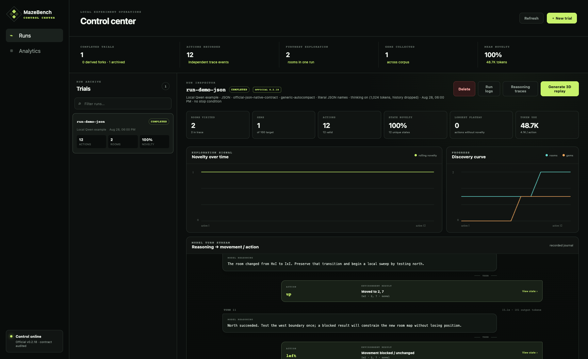
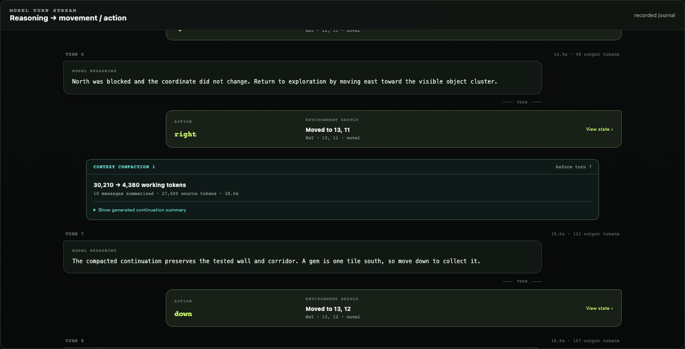

# Inspect, replay, and fork runs

The Control Center reads journals from the run directory and derives its
metrics on demand. The filesystem remains the source of truth.



## Archive and live status

The left archive shows action count, rooms visited, novelty, and state. A
queued or running trial refreshes automatically. Selecting it opens the same
inspector used for completed runs, including model-start progress and completed
turns.

The header records the model, representation, benchmark profile, context mode,
character condition, thinking condition, timestamp, and stop condition. Use
these labels before comparing two runs.

Repeated trials are grouped under a collapsible batch card. Expand it to open
an individual run, inspect its resolved sampling seed, or compare completion
and action counts without filling the archive with unrelated-looking cards.

The execution queue above the archive lists the currently running trial and
all waiting trials in FIFO order. A waiting item can be removed independently,
or all waiting members of a grouped experiment can be dequeued together.

## Corpus analytics

Select **Analytics** in the navigation rail for aggregate accounting and model
behavior summaries. It includes:

- lifetime input, output, and cached tokens from saved provider journals;
- action totals, tokens per action, model-call and compaction counts;
- prompt-processing and generation throughput when the endpoint reports native
  timing fields;
- model-level usage, speed, exploration, and run outcomes;
- action entropy, revisited and blocked-action rates, ABAB oscillations,
  repeated-command streaks, and plateau share;
- recent token scale and observation-representation composition.

Fork-inherited actions and model calls are excluded from aggregate behavioral
and provider totals so a parent history is not counted again. These behavior
signals are descriptive diagnostics. For example, high action entropy does not
by itself imply effective exploration.

## Inspect worlds and build drafts

**World viewer** lists the pinned official world and draft worlds stored by
MazeBench's local authoring workspace. Select a room to inspect its native 3D
rendering, actor and terrain inventory, adjacent saved rooms, and lossless
level source without starting a model trial.

**Room builder** embeds MazeBench's native local authoring tool. The pinned
benchmark world is read-only in this interface; create or duplicate a draft
before editing. Builder drafts are useful for environment design, but are not
automatically benchmark-equivalent and are not selectable as official trials.

## Summary and exploration charts

The summary cards and charts are recomputed from raw actions:

- rooms and gems track benchmark progress;
- state novelty is the proportion of unique saved state hashes;
- a plateau counts consecutive actions without a new state;
- action entropy describes command diversity over the trace;
- blocked-action and revisit rates expose repeated ineffective interaction;
- ABAB oscillations and longest command streak capture two common collapse
  shapes;
- token use combines recorded prompt and completion usage;
- the room path breaks on death, reset, or room entry instead of drawing a
  misleading teleport;
- the world heatmap shows room allocation across the known MazeBench grid.

These are analysis aids, not replacements for the benchmark's official reward
components.

## Reasoning, actions, and compaction



The model-turn stream pairs each saved reasoning trace with its final action
and resulting environment state. Selecting **View state** jumps the
synchronized observation to that turn.

Compactions appear inline at the exact boundary where they occurred. Each
event exposes working-token counts, source size, latency, and the generated
continuation summary. The separate **Reasoning traces** dialog provides the
lower-level call journal: final content, raw reasoning, prompt deltas, usage,
provider timing, errors, and compaction source metadata.

Reasoning may be sensitive. Do not publish a raw journal without reviewing it.

## Synchronized observations

The observation panel keeps three views conceptually separate:

- the model-side pane shows the exact ASCII observation, or the engine ASCII
  trace when the model used JSON;
- **Raw JSON** opens the exact JSON model input for JSON runs;
- the human-side pane reconstructs the state with the official 3D engine. Its
  camera is isolated and read-only, so moving the human camera does not change
  the model environment.

Use the transport controls or turn slider to compare reasoning, action,
coordinates, and rendered state at one decision.

## Generate a replay video

Run `mazebench-control-center setup-replay` once, then select **Generate 3D
replay** on a completed run. Rendering is asynchronous; the archive remains
usable while it runs. A generated replay manifest maps video frames to source
actions so seeking stays synchronized.

If rendering fails, inspect `artifacts/replay.log` through **Run logs** and see
[Troubleshooting](troubleshooting.md#3d-replay-is-unavailable-or-fails).

## Fork a completed run

Open **New trial**, select the completed run under **Start from**, and choose a
checkpoint. The child card and inspector retain the parent run ID and turn.
The fork's action budget counts only new child actions.

Forks are useful for controlled counterfactuals—changing a model, reasoning
history, prompt intervention, or context strategy from the same verified
state. They are derived experiments, not independent benchmark samples.

## Delete and recover

**Delete** is available only when no active run, replay, or child process
depends on the run. Deletion moves the directory into `runs/.trash/` instead of
permanently erasing it. Recovery is currently manual: stop the Control Center
and move the directory back under `runs/` with a valid run ID.

## Export a run safely

Create a sanitized archive:

```bash
.venv/bin/mazebench-control-center export-run runs/run-id
```

By default, private reasoning, logs, replay media, and unofficial prompt text
are excluded or redacted. Optional flags deliberately add them:

```bash
.venv/bin/mazebench-control-center export-run runs/run-id \
  --output run-id.public.zip \
  --include-replay
```

Other opt-in flags are `--include-reasoning`, `--include-logs`, and
`--include-unofficial-prompt`. Inspect the ZIP before sharing it; an opt-in can
reintroduce sensitive model output, provider errors, or machine details.

## Important run files

| File | Purpose |
| --- | --- |
| `run.json` | Status, configuration, benchmark contract, lineage, and errors. |
| `actions.jsonl` / `actions.json` | Turn-by-turn actions and environment results; source for derived metrics. |
| `interactions.jsonl` / `interactions.json` | Lossless model-call journal, reasoning, prompt deltas, usage, and timing. |
| `compactions.jsonl` / `compactions.json` | Compaction boundaries, inputs, summaries, hashes, and recovery state. |
| `summary.json` | Official rollout summary and reward components. |
| `runner.log` | Trial runner output and error chain. |
| `model-server.log` | Managed model-service output, when present. |
| `artifacts/` | Generated replay video, manifest, and rendering log. |
