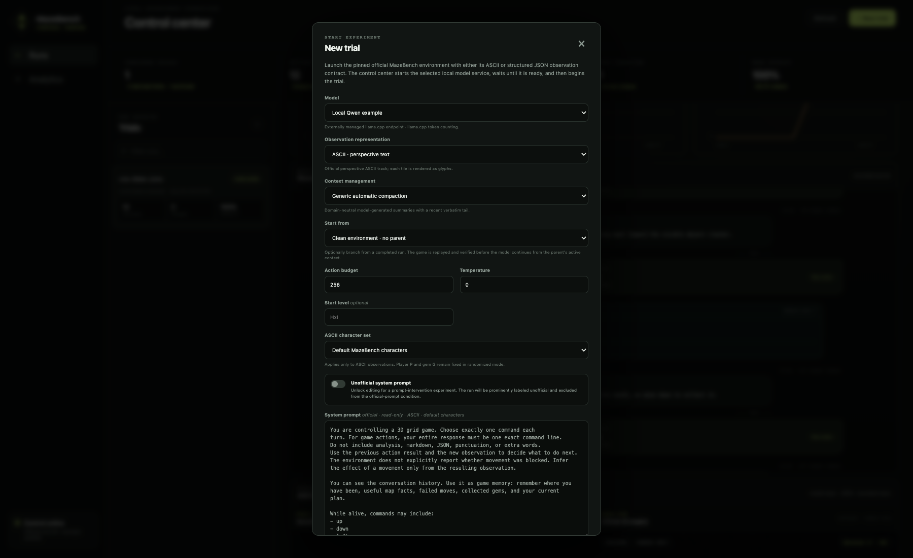

# Configure a new experiment

Open **New trial** from the top-right of the Control Center.

The form is part of the experimental record. Representation, context,
reasoning, prompt, and fork choices are saved in the run manifest rather than
treated as presentation preferences.

## Core settings

| Field | Meaning |
| --- | --- |
| **Model** | Selects one profile from the server's model configuration. Managed profiles start their process for the trial; external profiles must already be reachable. |
| **Observation representation** | Chooses the official ASCII perspective-text or structured JSON condition. This changes both observations and the audited representation-specific instruction. |
| **Context management** | Chooses generic Control Center compaction or forwards the growing conversation unchanged to an endpoint/upstream harness. |
| **Start from** | Starts independently or branches from a completed parent run. |
| **Action budget** | Maximum new actions for a clean trial. For a fork, this is additional to the inherited parent checkpoint—for example, turn 136 plus a budget of 256 can reach 392. |
| **Temperature** | Sampling temperature sent to the model endpoint. Record it consistently across comparisons. |
| **Repetitions** | Queues independent trials of the same configuration and runs them sequentially so one local model service is never overloaded. |
| **Base sampling seed** | Seeds the first repetition; later repetitions increment it by one. The resolved seed is saved with each run. |
| **Start level** | Optional controlled starting level. Leave empty for the normal benchmark selection. A fork always inherits the parent's level and state. |

## Repeated trials

Use repetitions when one sampled trajectory is not enough evidence. The
Control Center creates every run up front, executes them sequentially, and
groups them under one collapsible batch in the archive. Stopping an active
batch cancels its queued repetitions. Deleting a completed batch moves all of
its run directories to recoverable trash.

Apart from their sampling seeds, repeated runs receive the same submitted
configuration. They remain separate run artifacts rather than being averaged
into a new benchmark score.

## Queue several experiments

Launching a new experiment while another trial is running adds it to one
process-wide FIFO queue. The Runs sidebar shows the active trial, every waiting
trial, and each waiting position. This lets managed model profiles run safely
without overlapping service lifecycles.

Select **Remove** beside a waiting trial to cancel only that item. Select
**Dequeue batch** on a grouped experiment to cancel all of its waiting
repetitions. Neither action stops a repetition that is already running. Use
**Stop batch** when the intended operation includes the running member.

The queue is runtime state. Restarting the Control Center cancels pending jobs;
completed and partially written run directories remain the filesystem record.

## Observation representation

### JSON

JSON supplies visible objects and coordinates with literal object-type names.
ASCII character settings are disabled because they do not apply. The Control
Center still shows the engine's ASCII snapshot and official 3D view for human
inspection; the **Raw JSON** button exposes the exact structured observation
sent to the model.

### ASCII

ASCII supplies the official perspective-text observation. It has two recorded
character conditions:

- **Default MazeBench characters** uses the canonical representation.
- **Stable randomized characters** deterministically randomizes identities
  from the supplied seed while keeping the official fixed identities described
  by the benchmark contract.

Use the same seed when comparing models under one randomized representation.
Changing the seed is a distinct experimental condition.

## Context management

### Generic automatic compaction

The Control Center asks the selected model for a domain-neutral continuation
summary and retains a recent verbatim tail. The summary, source boundary,
token counts, latency, hashes, and any recovery attempt are journaled. Raw
interaction records remain on disk.

### Endpoint-managed / no Control Center compaction

The Control Center forwards the ordinary growing conversation without
summarizing or truncating it. Choose this only when:

- the run is expected to fit in the endpoint context window; or
- an upstream endpoint/harness deliberately manages context itself.

An OpenAI-compatible wire format is normally stateless. It does not imply that
Claude Code, Codex, or another agent-style compactor is present behind the
endpoint.

## System prompt

By default, the exact audited, representation-specific game-agent prompt is
shown read-only. This is the text sent in the system role and saved with the
run.

Enable **Unofficial system prompt** only for a prompt-intervention experiment.
The edited text is sent exactly, and the resulting run is prominently labeled
unofficial. Do not compare it as if it were the untouched prompt condition.

## Thinking controls

Thinking controls are enabled only for a model profile with
`thinking_contract = "qwen"`.

- **Enable model thinking** requests a separate reasoning trace before the
  final action and increases latency, output tokens, and context pressure.
- **Thinking budget** limits reasoning output per action. A very small budget
  may end before a usable final action; a large budget can make local runs
  substantially slower.
- **Preserve previous thinking verbatim** feeds earlier reasoning blocks back
  on ordinary turns. When disabled, reasoning is still saved for analysis and
  may be represented by compaction, but it is not replayed verbatim every turn.

Saving a reasoning trace and feeding the trace back into future context are
separate choices.

## Fork from a checkpoint

After selecting a completed parent, choose a **Fork checkpoint** turn. The
Control Center:

1. restores the parent's active context through that turn, beginning from its
   latest applicable compaction summary rather than replaying discarded
   pre-compaction messages;
2. replays actions to reconstruct the game state;
3. verifies the reconstructed checkpoint against the journal;
4. starts a child run whose action budget is additional.

The child may select a different model, reasoning condition, future compaction
mode, or explicit unofficial prompt. Those changes are recorded as the child
condition; the state and inherited context retain parent provenance.

## Recommended first smoke test

Use a deliberately inexpensive trial before a long experiment:

- JSON observations;
- 8–16 actions;
- temperature 0;
- thinking disabled, unless thinking is the feature being validated;
- generic automatic compaction, although a smoke test should finish before it
  triggers;
- official read-only prompt;
- clean environment.

Confirm that actions appear live, token usage is nonzero, and the run completes
without an endpoint error before increasing the budget.
